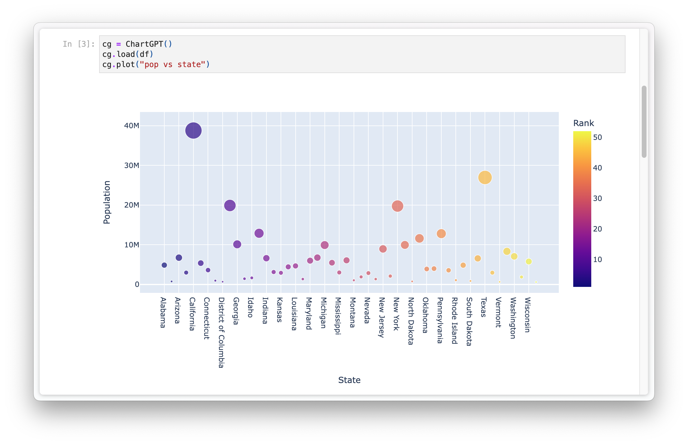
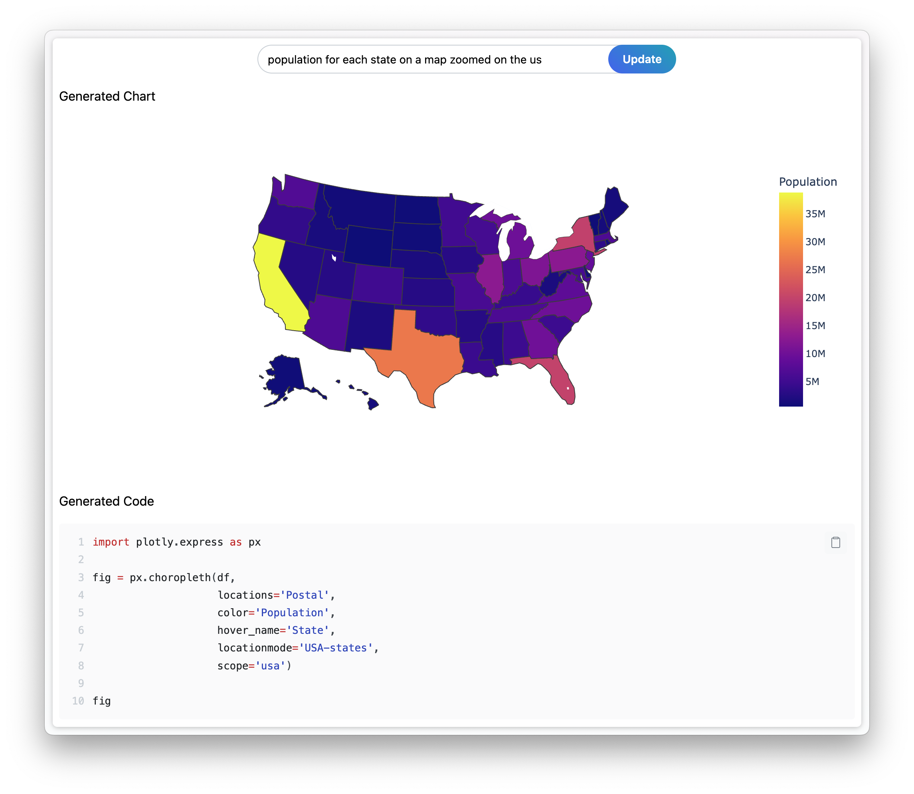

# ChartGPT ✨📊

[](https://colab.research.google.com/drive/1RokFYWHiW0aZOYpOTXbf3HJIzEslbZ6i?usp=sharing)

ChartGPT is a lightweight and user-friendly tool designed to assist you in visualizing your Pandas dataframes. Whether you are working in a Jupyter notebook or developing a Dash app, ChartGPT makes it effortless to generate stunning charts and plots. 📈

## Features 🌟

- Intuitive integration with Pandas dataframes 🐼
- Supports both Jupyter notebooks and Dash apps 📓🚀
- Simple installation and setup ⚙️

## Installation ⬇️

You can install ChartGPT using pip:

```shell
pip install chartgpt
```

## Example Usage 🎉

### Jupyter Notebook 📔



```python
from chartgpt import ChartGPT

# Load your Pandas dataframe
df = pd.read_csv('data.csv')

# Add OpenAI API key
cg = ChartGPT(api_key="YOUR_API_KEY")

# Load the dataframe
cg.load(df)

# Use ChartGPT to plot the dataframe
cg.plot("ask me about my chart!")
```

### Dash App 🚀



See Dash example [here]().

## Documentation 📚

For detailed information on how to use ChartGPT, please refer to the [documentation](https://chatgpt.github.io/chart/).

## License 📜

This project is licensed under the MIT License - see the [LICENSE](LICENSE) file for details.
